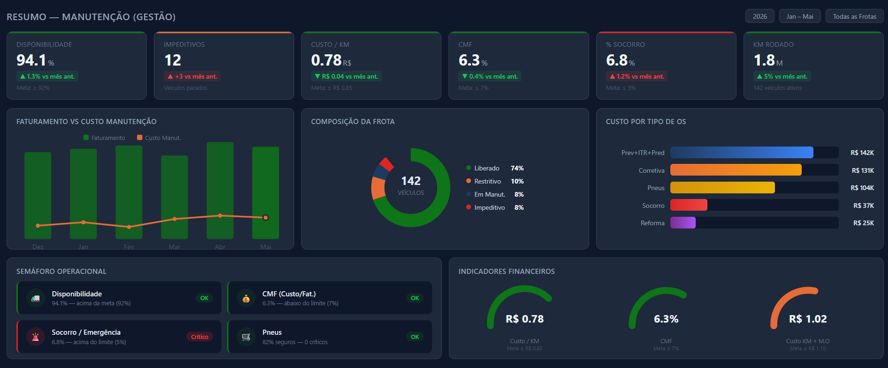
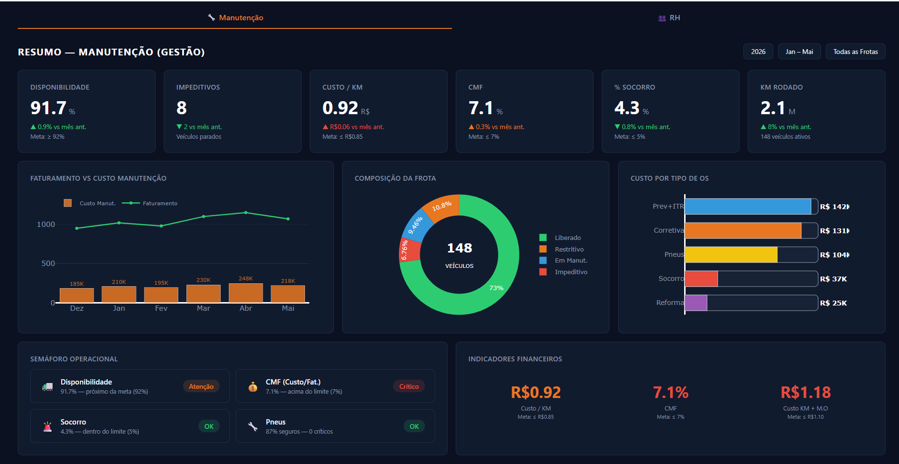
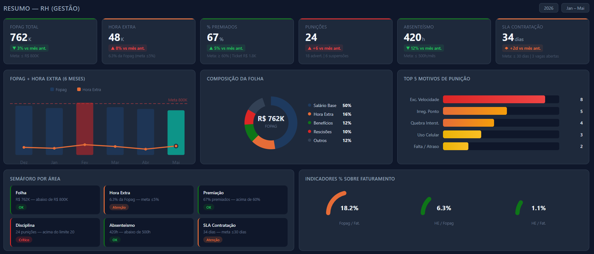
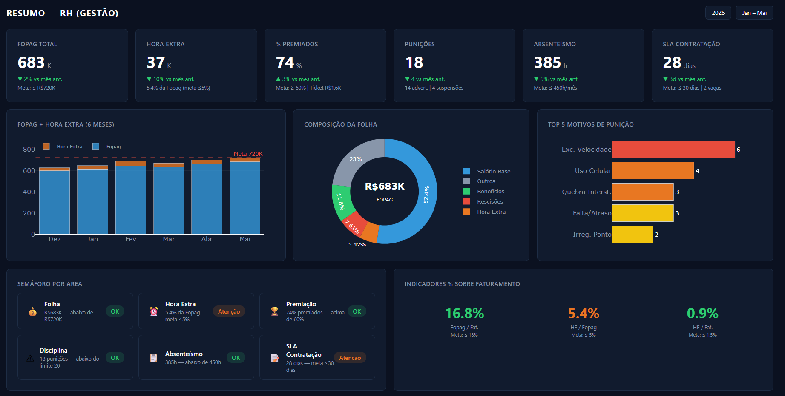
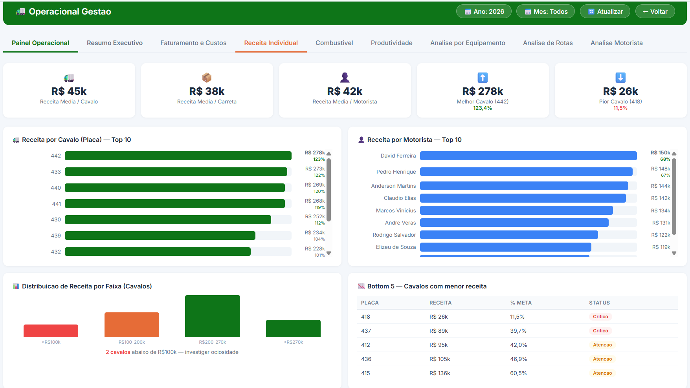
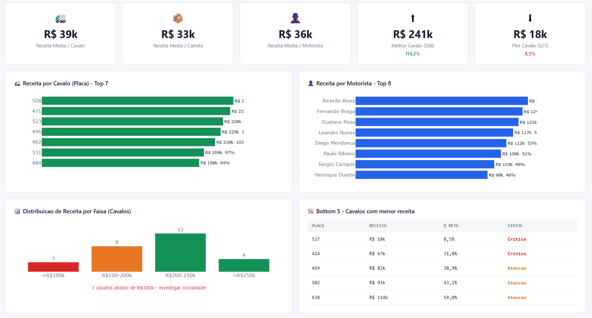
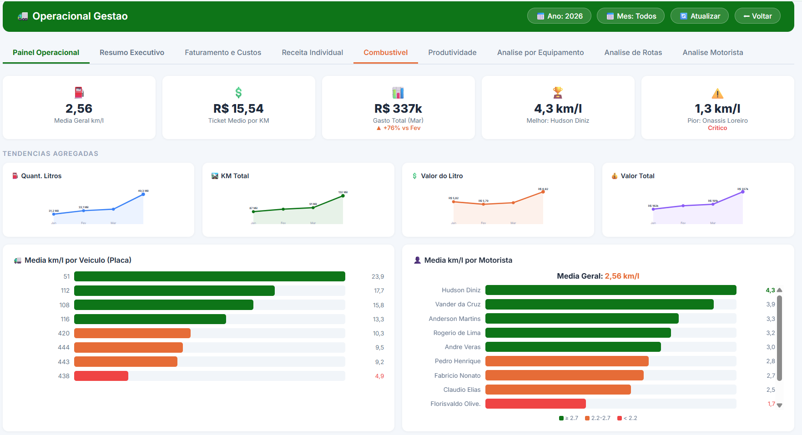
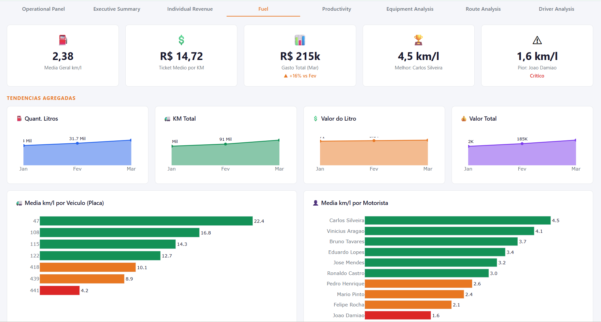

# 📊 Logistics Executive Dashboard

A full-stack analytics dashboard built with Python and Dash, designed to give directors real-time visibility into logistics operations across multiple business areas.

---

## 🎯 The Problem

A logistics company operating in the Chemical Products and Oil & Gas sectors needed a centralized tool for executive meetings. Leadership had to rely on scattered spreadsheets and manual reports to monitor performance across sales, operations, maintenance, HR, finance, safety, and IT — making it hard to spot risks and make fast decisions.

## 💡 The Solution

An interactive, multi-sector dashboard deployed in production with:

- **7 sector views** — each with tailored KPIs, charts, and alerts
- **Role-based access** — Firebase authentication so each manager sees their relevant data
- **Live data pipeline** — automated extraction from BigQuery, Excel uploads, and external APIs
- **Conditional formatting** — green/yellow/red visual alerts based on KPI thresholds

---

## 🖼 Design Process — Mockup → Result

I designed mockups before writing any code to align expectations with stakeholders.

### 🔧 Maintenance Sector (Dark Theme)

| Mockup | Dashboard |
|--------|-----------|
|  |  |

### 👥 HR Sector (Dark Theme)

| Mockup | Dashboard |
|--------|-----------|
|  |  |

### 🚛 Operational — Individual Revenue (Light Theme)

| Mockup | Dashboard |
|--------|-----------|
|  |  |

### ⛽ Operational — Fuel Analysis (Light Theme)

| Mockup | Dashboard |
|--------|-----------|
|  |  |

---

## 🏗 Architecture

```
User (Browser)
    │
    ▼
Dash App (Python)  ←──  Firebase Auth (login/roles)
    │
    ├── BigQuery (data lake - automated queries)
    ├── Excel uploads (manual sector data)
    └── External APIs (checklist & monitoring systems)
    │
    ▼
Interactive Dashboard (Plotly charts + KPI cards)
```

**Key technical decisions:**
- **Thread-safe caching with TTL** — avoids redundant queries and keeps the app fast
- **BigQuery MERGE/UPSERT** — deduplication strategy to prevent duplicate records
- **Adaptive table catalog** — regex-based discovery of monthly tables in the data lake
- **Docker deployment** — containerized for consistent production environment

---

## 🛠 Tech Stack

| Category | Tools |
|----------|-------|
| Backend | Python, Dash |
| Data | Pandas, BigQuery, SQL |
| Visualization | Plotly, Dash components |
| Auth | Firebase |
| Deployment | Docker |
| Version Control | Git, GitHub |

---

## 📈 Impact

- Replaced **scattered spreadsheets** with a single source of truth for executive meetings
- Enabled directors to monitor **KPIs in real time** instead of waiting for monthly reports
- Reduced meeting prep time — managers open the dashboard, not a pile of Excel files
- Color-coded alerts helped identify **risk areas** before they became problems

---

## 🚀 How to Run Locally

```bash
# Clone the repository
git clone https://github.com/Thiellysilva/logistics-dashboard.git

# Install dependencies
pip install -r requirements.txt

# Run the showcase (synthetic data — no real company data)
python showcase_dark_final.py    # Maintenance + HR panels → http://127.0.0.1:8060
python showcase_op_limpo.py      # Operational panels → http://127.0.0.1:8061
```

> ⚠️ This is a showcase version with **synthetic data**. No real company data is included.

---

## 📝 Lessons Learned

- **Design first, code second** — mockups saved weeks of rework by aligning expectations early
- **Business context matters** — the same data tells different stories depending on which KPI you choose
- **Authentication is not optional** — even internal tools need access control when directors are involved
- **Caching strategy is critical** — without TTL-based caching, BigQuery costs would spike during meetings

---

*Built by [Thielly Silva](https://www.linkedin.com/in/thielly-vitoria/) — Data Analyst passionate about turning complexity into clarity.*
